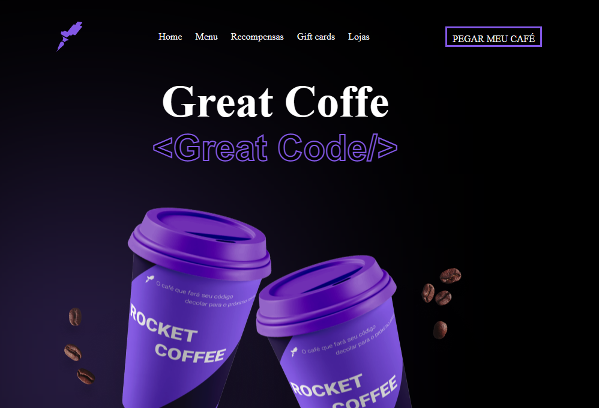

<h1> Projeto feito com html, css e javascript! </h1>

 
Desafio da Rocketseat☕️🚀

 <a href="https://64891f1956f5264a255f2e38--heroic-queijadas-de847e.netlify.app/#">VER PROJETO</a>

## Desafio RocketCoffee
O desafio RocketCoffee consiste em desenvolver uma interface intuitiva e fácil de usar.

### Requisitos do projeto
-precisa ser responsivo e funcionar tanto em dispositivos móveis quanto em computadores desktop.

-Menu responsivo em telas de no máximo 700px.

